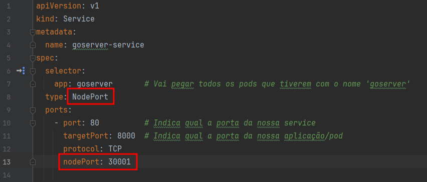
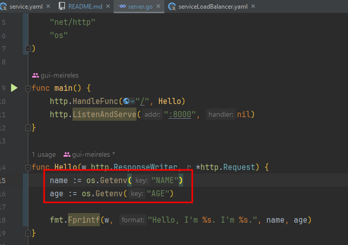
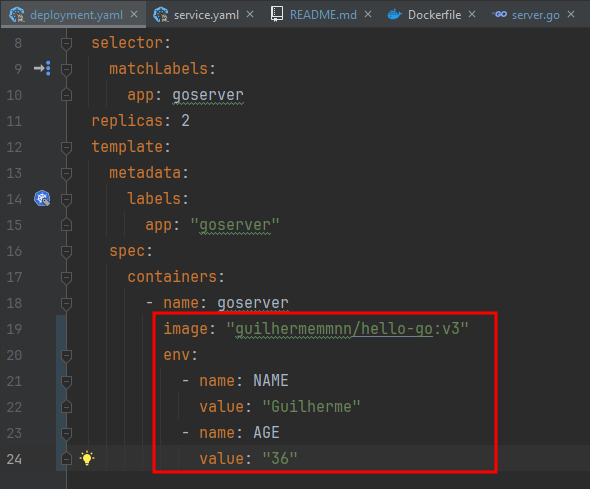
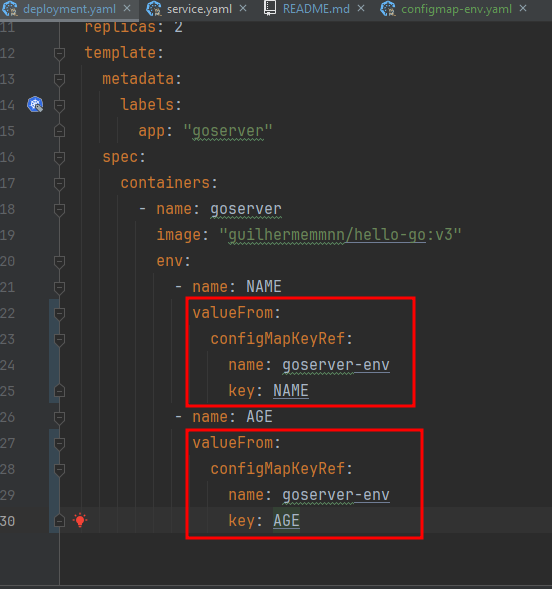
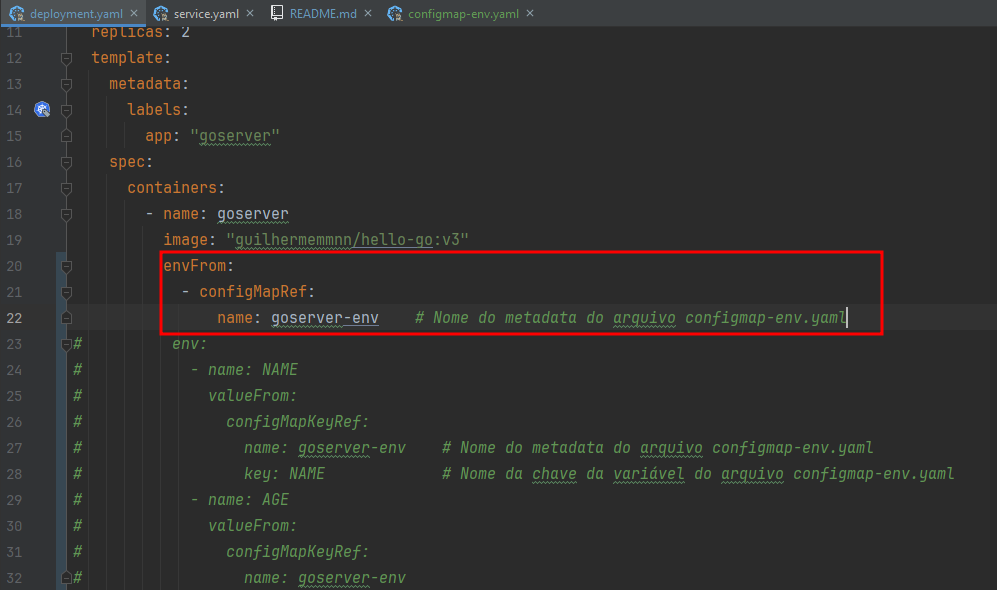
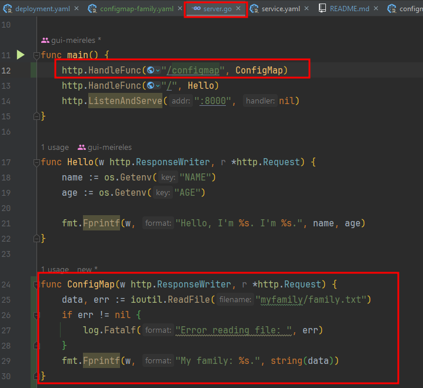
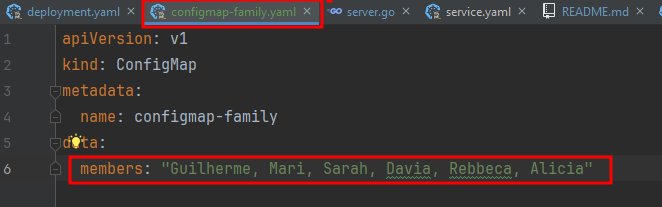
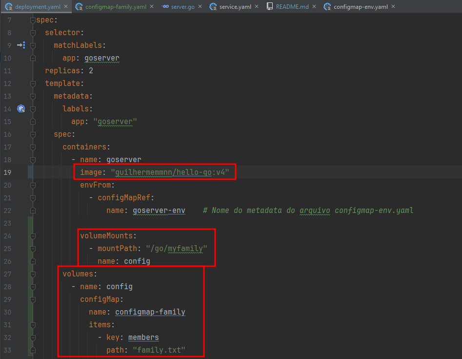
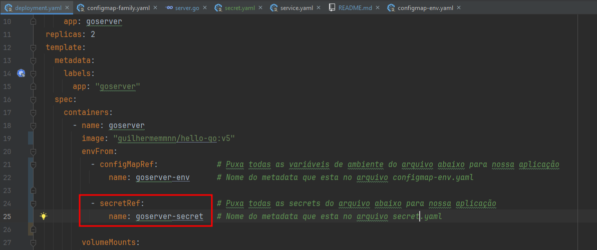
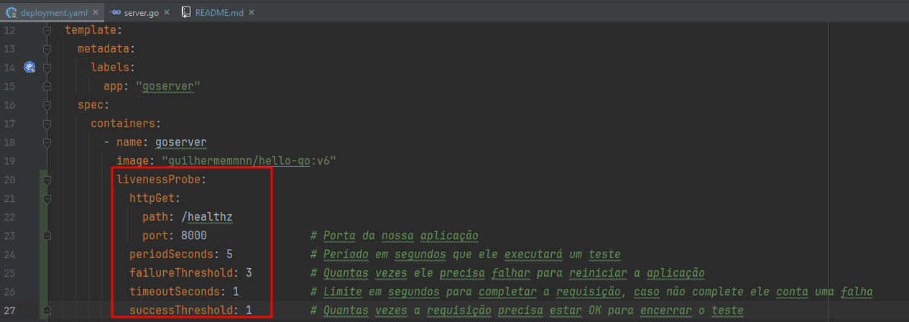

# Kubernetes/ k8s

## Criando cluster k8s com o 'kind'

Instale o kind em sua máquina: https://kind.sigs.k8s.io/docs/user/quick-start/

Instale o kubernetes em sua máquina: https://kubernetes.io/docs/tasks/tools/install-kubectl-windows/

---

Para subirmos o nosso cluster com as configurações do `kind.yaml`, digitamos no terminal:
`kind create cluster --config=k8s/kind.yaml --name=fullcycle`.

Para checar se ele está rodando, utilize o comando: `kubectl cluster-info --context kind-fullcycle` ou
`docker ps`.

E para ver os nodes: `kubectl get nodes`.

---

## Subindo nossa aplicação go

Abra um terminal na raiz do projeto e digite: `docker build -t guilhermemmnn/hello-go .`

Agora rode: `docker run --rm -p 80:80 guilhermemmnn/hello-go`.

E se você abrir o seu navegador e digitar localhost, você verá **Hello Guilherme**.

Caso queira, você pode subir essa imagem no seu DockerHub: `docker push {usuario}/hello-go`

Agora, vamos criar nosso primeiro pod: `kubectl apply -f k8s/pod.yaml`, podemos
verificar os pods com o comando: `kubectl get pods`.

Podemos acessar nosso pod com o comando: `kubectl port-forward pod/goserver 8000:80`,
que vai direcionar a porta 8000 da nossa máquina para a porta 80 do pod selecionado, agora
abra o seu navegador e digite `localhost:8000`.

> Para deletar o pod, utilize o comando: `kubectl delete pod goserver`.

---

### O que é ReplicaSet ?

- **Obs: Caso você queira subir mais de um pod, podemos usar o ReplicaSet e para subir
ele, certifique-se que não tenha nenhum pod rodando e siga os passos abaixo:**

No terminal digite: `kubectl apply -f k8s/replicaset.yaml`.

Se você rodar o comando: `kubectl get pods`, você verá os 2 pods rodando.
> Caso você delete um pod, ele criará automaticamente outro, pois no arquivo
> `replicaset.yaml` foi configurado para rodar no mínimo 2 pods.

### Problema do ReplicaSet

Caso você gere e suba uma nova versão da sua imagem docker e já tenha ajustado a versão no `replicaset.yaml`
você deve deletar todos os pods que estão rodando a versão antiga para ele baixar a nova.

> Você pode ver qual imagem cada pod está rodando com o comando: `kubectl describe pod {nome_do_pod}`.
> 
> E deletá-lo com o comando: `kubectl delete pod {nome_do_pod}`.

#### Como solucionar o problema do ReplicaSet ?

Podemos utilizar o famoso **Deployment**, ele fica no topo da hierarquia sendo:

**Deployment -> ReplicaSet -> Pod**

> Antes de iniciar com o Deployment, certifique-se que não tenha o replicaset anterior rodando,
> para isso utilize o comando `kubectl get replicaset`.
>
> Caso tenha utilize o comando: `kubectl delete replicaset {nome_da_replicaset}`.
> 
> Logo após vamos criar o nosso **Deployment** com o comando: `kubectl apply -f k8s/deployment.yaml`.
> 
> E para verificarmos ele rodando: `kubectl get deployments`.

**E a vantagem é** que caso você **altere a versão da imagem** no `deployment.yaml`, basta você digitar o comando:
`kubectl apply -f k8s/deployment.yaml` e ele criará um novo replicaset com novos pods na nova versão.

---

### Rollout de versões antigas

Caso você queira voltar um deployment antigo, você tem a possibilidade.

Com o comando: `kubectl rollout history deployment {nome_do_deployment}`, conseguimos
ver as versões/revisions que já foram utilizadas no deployment.

E para fazer o rollout desse deployment para a versão passada,
utilize o comando: `kubectl rollout undo deployment {nome_do_deployment}`.

> Dica: Caso queira fazer o rollout de uma versão específica, você pode utilizar
> o comando: `kubectl rollout undo deployment {nome_do_deployment} --to-revision={numero_revision}`.

---

## Services

A service é a porta de entrada da nossa aplicação e serve para acessarmos nossos pods.  
Funciona como um _**load-balancer**_ em que ela faz o gerenciamento dos acessos e direciona para nossos pods

### Criando service com ClusterIP

Esse tipo de Service é utilizado para permitir a comunicação entre diferentes Pods e outros componentes do cluster.

O **IP** não é acessível de **_fora_** do cluster, você pode utilizar o **nome da service** para os pods conseguirem se comunicar e
o **ClusterIP** distribui o tráfego entre os Pods que estão associados ao Service (Load balancer).

No terminal, rode o comando: `kubectl apply -f k8s/service.yaml`.
Assim que criado, podemos checar a service com: `kubectl get svc`.

**Como acessar o cluster de fora?** 
Temos que fazer um direcionamento de porta para conseguirmos acessar o ip do cluster, para isso
utilize o comando: `kubectl port-forward svc/goserver-service 8000:80`.

Então podemos acessar via navegador com localhost:8080 ou com o comando: `curl http://localhost:8000`.

### Como direcionar a porta do nosso container ?

As vezes, criamos nossa service na porta `X` e nosso pod/aplicação está na porta `Y`, como é feito esse
direcionamento de portas?

**E a resposta é SIMPLES:**

- Utilizamos o `targetPort` em nosso `service.yaml`:

> **Ou seja**, o `port` é a porta da nossa service, e `targetPort` é a porta do nosso container que está a aplicação.

---

### Acessando a api do Kubernetes por Proxy

Ele vai gerar um proxy da nossa máquina para a api do Kubernetes e assim podemos ter acesso na api do Kubernetes.

Para isso, utilizamos o comando: `kubectl proxy --port=8080`.  
E podemos acessar pelo navegador: `localhost:8080`, você verá alguns endpoints que o kubernetes oferece,
e para acessar o endpoint da nossa service que foi criada acima, digite:
`localhost:8080/api/v1/namespaces/default/services/goserver-service`.

---

### Como funciona o tipo NodePort da service ?

**Serve para expor uma porta para fora do Cluster.**

Utilizado mais para demonstração, pois ele libera uma porta para todos os nodes da service, ou seja,
caso alguém tenha o IP de um dos nodes(máquinas) e a porta, ele conseguirá entrar dentro da service,
que redirecionará para uma `targetPort`.

- Abaixo podemos ver como é feito a criação de uma service com o tipo **NodePort**:

> Podemos escolher uma nodePort entre **30000** à **32767**.

---

### Como funciona o tipo Load Balancer da service ?

**O tipo LoadBalancer cria um ip externo para acessarmos a service**

Muito utilizado para expor um serviço na internet com auxílio de um provedor de nuvem (AWS, Google Cloud).

Para criarmos, certifique-se de ter deletado a service do exemplo anterior, para isso use o comando:
`kubectl delete service goserver-service`.

E para criar: `kubectl apply -f k8s/serviceLoadBalancer.yaml`.

> Caso tivessemos rodando essa service em uma AWS, ele geraria um `EXTERNAL-IP`, que permitiria a conexão
> de qualquer pessoa que tivesse esse **IP**.
> 

---

## O que são variáveis de ambiente

Com variáveis de ambiente conseguimos proteger dados sensíveis como senhas, ips, etc... no arquivo yaml e
puxar na nossa aplicação, como na imagem abaixo:

> **Aqui estamos puxando as variáveis de `NAME` e `AGE`.**

> Aqui estamos **configurando as variáveis e seus values** no arquivo `deployment.yaml`, certifique-se de gerar
> uma imagem do seu **Dockerfile** e subir ele no _DockerHub_ e ajustar no arquivo do `deployment.yaml`.

- Aplique essa configuração no Cluster com o comando: `kubectl apply -f k8s/deployment.yaml`.
- Faça o redirecionamento da porta do cluster com a sua máquina: `kubectl port-forward svc/goserver-service 8000:80`.
- Acesse pelo navegador: `localhost:8000` e veja a mágica acontecer!

## Como apartar as variáveis de ambiente?

Podemos criar um arquivo `yaml` com o **kind=ConfigMap**, igual ao arquivo `configmap-env.yaml` e
setar nossas variáveis lá dentro.

> E com um pequeno ajuste no nosso arquivo `deployment.yaml` podemos capturar a variável do nosso arquivo
`configmap-env.yaml`:
>
> 

**Agora iremos subir esse ajuste no Kubernetes, para isso:**

- Rode o comando: `kubectl apply -f k8s/configmap-env.yaml` e como mudamos o deployment precisamos subir
ele também: `kubectl apply -f k8s/deployment.yaml`

- Para testar, precisamos conectar uma porta da nossa máquina com a do Cluster: `kubectl port-forward svc/goserver-service 8000:80`

### E se tivermos muitas variáveis?

Caso tenha _**muitas variáveis de ambiente**_, nosso arquivo `deployment.yaml` ficaria **muito poluído** se
seguirmos no exemplo acima, para isso podemos utilizar o seguinte formato:

> Com o envFrom, chamamos nosso arquivo `configmap-env.yaml` com o nome do seu metadata e assim o nosso
> `deployment.yaml` terá TODAS as variáveis do arquivo `configmap-env.yaml`. 
> 
> E para aplicar, basta rodar os comandos novamente: `kubectl apply -f k8s/configmap-env.yaml` e
> `kubectl apply -f k8s/deployment.yaml`.

### Agora vamos criar um volume para as variáveis

Suponha que sua aplicação precise ler um arquivo `.txt` e esse arquivo é **dinâmico**, para evitar toda vez que
esse arquivo tiver uma alteração e você precisar **buildar** a aplicação e **subir** no DockerHub, você pode injetar
o **ConfigMap** na sua aplicação:

- Para isso, criamos uma função na nossa aplicação **Go** que vai ler um arquivo `.txt`:

- Em seguida, vamos criar nosso arquivo **.yaml** que terá o texto dinâmico:

- Em seguida, configuramos nosso `deployment.yaml`:
> 
> Importante que a sua imagem do hello-go esteja com a nova função de ler arquivo.

- E por fim aplicamos essas configurações no nosso Cluster:
`kubectl apply -f k8s/configmap-family.yaml`.  
`kubectl apply -f k8s/deployment.yaml`.  
`kubectl port-forward svc/goserver-service 8000:80`.
- E assim, conseguimos ver os nomes pelo navegador: `localhost:8000/configmap`.

> Caso você queira acessar o pod para ver se os arquivos foram criados, você pode rodar o comando:
> `kubectl exec -it {nome_do_pod} -- bash`.  
> Ou caso queira ver o log de erro, utilize: `kubectl logs {nome_do_pod}`.

## Como guardar uma secret ?

Para guardar dados sensíveis como senhas e usuários, podemos utilizar o arquivo `secret.yaml` com o **kind=Secret**
e temos que criptografar os dados em `base64`, você pode utilizar o comando: `echo "guilherme" | base64` e caso esteja
utilizando o _Windows_, rode esse comando pelo terminal do **_git Bash_**

- Após configurar sua `secret.yaml`, vamos configurar o arquivo `deployment.yaml`:

- E por fim seguimos o mesmo passo a passo:  
  `kubectl apply -f k8s/secret.yaml`.  
  `kubectl apply -f k8s/deployment.yaml`.  
  `kubectl port-forward svc/goserver-service 8000:80`.

- E assim, conseguimos ver o nosso usuário pelo navegador: `localhost:8000/secret`.

---

## Health check

### Criando endpoint Healthz

Vamos criar um endpoint na nossa aplicação Go para ver de tempos em tempos se ela está saudável.

Para isso, criamos uma função em nosso `server.go` bem simples para checar o tempo de início da nossa aplicação, e caso
a vida útil da nossa aplicação passe de 25 segundos, ele dará um erro **500** e ao acessar pelo `localhost:8000/healthz`,
veremos a duration da nossa aplicação.

> Lembre sempre de checar se o build da imagem do server.go está com a função `Healthz`.

#### Utilizando o Liveness

O **liveness probe** é responsável por verificar se um contêiner está em execução corretamente.  
Ele é utilizado para **determinar** se um contêiner **precisa ser reiniciado**.

Vamos configurá-lo em nosso `deployment.yaml`:

E podemos ir checando a reinicialização do nossos pods pelo comando: `kubectl get pods`.
> Como nossa aplicação está configurada para emitir um erro 500 depois de 25 segundos no ar,
> o nosso pod será reiniciado após esse período **+** o tempo que roda nosso teste no `deployment.yaml`.

